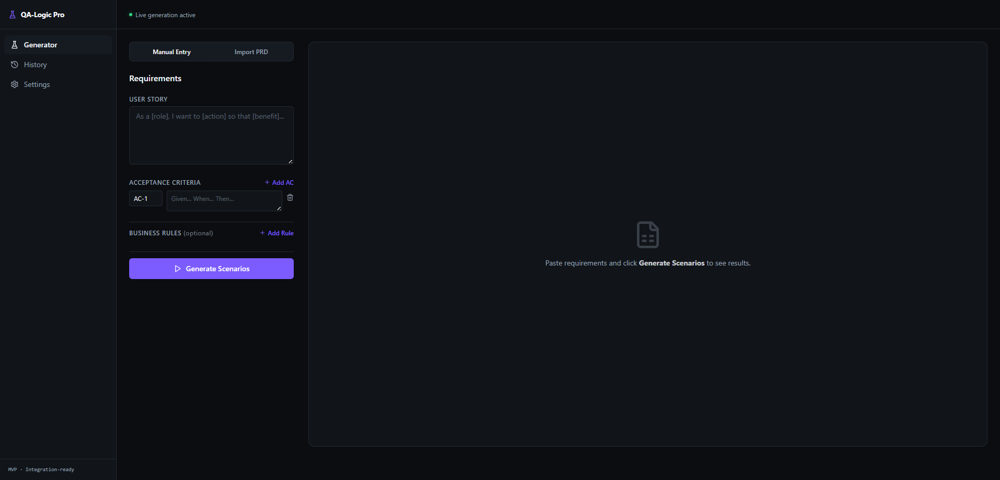
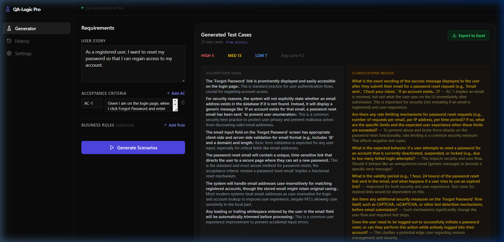
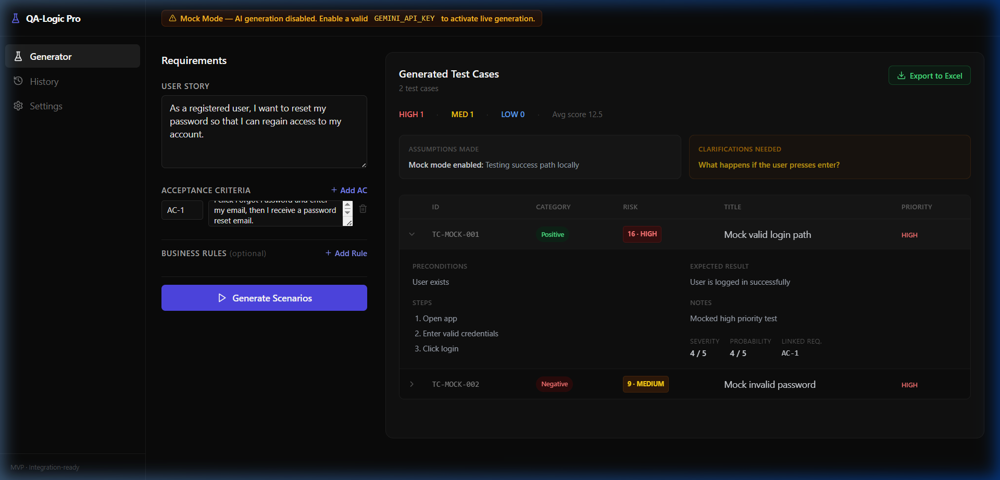
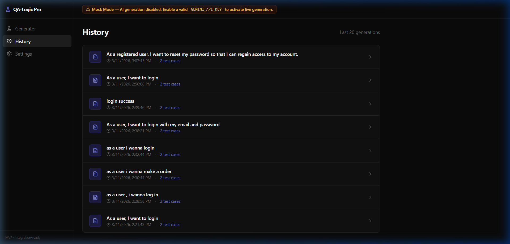
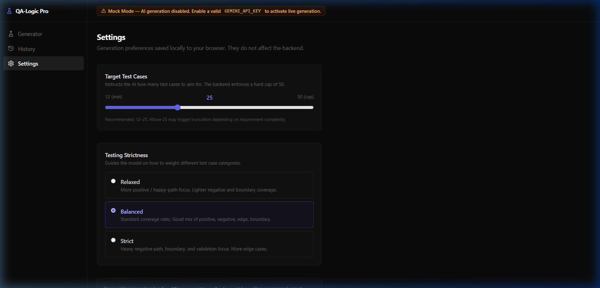

# QA-Logic Pro

**QA-Logic Pro** is an AI-assisted Quality Assurance web application that converts software requirements into structured test cases, assumptions, clarification questions, and deterministic risk scoring.

> ⚡ **Project Status: MVP-complete and integration-verified**  
> The **Live Gemini path is confirmed**. The application is structurally complete for its core use case. *Note: Production hardening is intentionally deferred.*

---

## 🎯 Overview

QA-Logic Pro bridges the gap between raw Product/Business requirements and actionable QA artifacts. It leverages LLMs for qualitative test generation alongside deterministic Python logic for predictable risk assessment, strict typing, and data export.

### Key Features
- **AI-Driven Structured Generation**: Transforms User Stories, Acceptance Criteria (AC), and Business Rules into comprehensive test suites using Google Gemini.
- **PRD Analyzer**: Upload a PDF or text PRD document and extract structured User Stories, Acceptance Criteria, and Business Rules automatically. Review and edit the extraction before hydrating the generator form.
- **Deterministic Risk Scoring**: Gemini suggests qualitative testing fields such as priority, severity, and probability. The Python backend deterministically computes `risk_score` and `risk_level`.
- **Quota-Optimized Generation**: Model strategy is configurable via environment variables. Business rules are filtered by contextual relevance before injection. Extraction enforces a character budget. Default output count is set conservatively.
- **Excel Export**: Generates `.xlsx` files entirely in-memory and streams them to the client.
- **History Persistence**: All generations, including the payloads and outputs, are saved via SQLite for future retrieval and review.
- **Configurable Strictness**: Settings for "Target Test Case Count" and "Testing Strictness" (Relaxed, Balanced, Strict) are managed via robust browser-local orchestration.
- **Mock Mode**: Supports offline UI/UX validation and contract simulation without requiring active API usage.

---

## 🛠 Tech Stack

**Frontend**
- React 18
- TypeScript
- Vite
- Tailwind CSS
- lucide-react (Icons)
- axios (Networking)
- react-hook-form (Form Management)

**Backend**
- Python 3.10+
- FastAPI
- Pydantic
- SQLAlchemy + aiosqlite (Database layer)
- Google GenAI SDK (Gemini inference)
- openpyxl (Excel export utility)

---

## 🏛 Architecture

### Frontend Responsibilities
- Manages local settings orchestration (`localStorage`).
- Maintains complex, dynamic input arrays for requirements.
- Handles API exceptions and routes network errors to UI banners.
- Conditionally reflects active `MOCK_MODE` vs live Gemini state via the backend `/status` check.

### Backend Responsibilities
- Payload validation via Pydantic matching real-world QA requirements.
- Invokes the Gemini prompt and coerces output strictly into Pydantic models.
- Computes deterministic `risk_score` and `risk_level`.
- Identifies out-of-bounds context (truncation fallback based on limits).
- Writes history payloads asynchronously via local background tasks.
- Produces native `.xlsx` binary streams.

---

## 📂 Project Structure

```text
qa_logic/
├── qa_logic_backend/
│   ├── app/
│   │   ├── api/v1/endpoints/  # API Routers (export.py, generate.py, health.py, history.py)
│   │   ├── core/              # Config, exceptions, standard error handlers
│   │   ├── db/                # SQLite setup, ORM models, sessions
│   │   ├── schemas/           # Pydantic contracts (ai, common, export, history, request, response)
│   │   └── services/          # Core logic (ai, export, history, risk, sanitization)
│   ├── tests/                 # Pytest suites (test_export, test_history, test_risk)
│   ├── requirements.txt
│   └── .env
│
└── qa_logic_frontend/
    ├── src/
    │   ├── components/        # MainLayout and shared UI
    │   ├── hooks/             # Local settings orchestration (e.g., useSettings)
    │   ├── pages/             # Dashboard, History, Settings views
    │   ├── services/          # API Axios client (api.ts)
    │   └── types/             # TS interfaces mapping backend models
    ├── package.json
    └── .env
```

---

## ⚙️ Environment Variables

Before running the application, ensure the `.env` files are created.

### Backend (`qa_logic_backend/.env`)

```env
# AI Settings
GEMINI_API_KEY=your_real_gemini_key_here
GEMINI_EXTRACTION_MODEL=gemini-2.5-flash
GEMINI_GENERATION_MODEL=gemini-2.5-flash
MOCK_MODE=False
DEBUG_AI_PIPELINE=False

# Backend Settings
CORS_ORIGINS=["http://localhost:5173", "http://127.0.0.1:5173"]
DATABASE_URL=sqlite+aiosqlite:///./qa_logic.db
```
*(Setting `MOCK_MODE=True` allows exploring the entire frontend UI safely without executing Gemini calls.)*
*(Set `GEMINI_EXTRACTION_MODEL=gemini-1.5-flash-8b` to reduce extraction quota costs.)*

### Frontend (`qa_logic_frontend/.env`)

```env
# Base URL for local FastAPI Backend
VITE_API_BASE_URL=http://127.0.0.1:8000/api/v1
```

---

## 🚀 Running Locally

### 1. Start the Backend

```bash
cd qa_logic_backend
python -m venv venv
.\venv\Scripts\activate      # Windows
# source venv/bin/activate  # macOS/Linux

pip install -r requirements.txt

# Start Dev Server
uvicorn app.main:app --host 127.0.0.1 --port 8000 --reload
```
The backend API documentation is available via Swagger UI at `http://127.0.0.1:8000/docs`.

### 2. Start the Frontend

```bash
cd qa_logic_frontend
npm install

# Start Vite Server
npm run dev
```
Open `http://localhost:5173` or `http://127.0.0.1:5173` in your browser.

---

## 🔌 API Endpoints
All routes exist under `/api/v1/`.

- `GET /health` — Simple connectivity check.
- `GET /status` — Exposes system health, Mock Mode state, and Gemini configuration status to the frontend.
- `POST /generate` — The primary route utilizing `GEMINI_API_KEY` to convert prompts to validated test case payloads.
- `POST /export` — Exports generated data from either the current payload or a history_id reference into an Excel stream.
- `GET /history` — Paginated history repository lookup.
- `GET /history/{history_id}` — Retrieves the exact payload and output response of a specific historical generation.

---

## 🧪 Testing

The backend implements automated testing using `pytest` with `pytest-asyncio` for asynchronous execution.

To execute the test suite:

```bash
cd qa_logic_backend
pytest tests/
```

The testing modules include:
- `test_export/`: Verifies in-memory Excel binary generation
- `test_history/`: Validates persistence models and database integration
- `test_risk/`: Tests deterministic risk scoring mechanisms

---

## 📋 Integration Verification Status

The current repository reflects an **Integration-Verified MVP**. Production hardening is intentionally deferred.

| Flow | Status | Mode |
|---|---|---|
| Mock Mode full end-to-end | ✅ Verified | Mock |
| Live Gemini generation smoke test | ✅ Verified | Live |
| SQLite persistence flow | ✅ Verified | Live |
| History list and history reopen | ✅ Verified | Both |
| Excel export (current + history) | ✅ Verified | Both |
| PRD file extraction and hydration | ✅ Verified | Live |
| PRD primary story selection | ✅ Verified | Live |
| PRD session cache (accept/discard) | ✅ Code-level verified | — |
| Dashboard sort / filter / search | ✅ Verified | Both |
| Expanded row detail panel | ✅ Verified | Both |
| Traceability chip rendering | ✅ Verified | Both |
| AI quota error UX (`AI_RATE_LIMIT`) | ✅ Verified | Live |
| Responsive layout | ✅ Verified | Both |

---

## 🗺 Roadmap / Next Improvements

The following features were intentionally considered out-of-scope for the MVP, but remain as follow-up priorities:
- Setup CI/CD pipeline automation
- Implement database migrations (Alembic)
- Configure application observability and logging telemetry
- Conduct load and stress testing
- Add deployment hardening and advanced security reviews
- Richer UI polish and layout feedback

---

## 📸 Screenshots

All screenshots captured from the live running application.

**Dashboard — Empty State**


**Dashboard — Generated Results (Mock Mode)**


**Dashboard — Expanded Row Detail**


**History Page**


**Settings Page**


---

## 📄 License

This project is licensed under the [MIT License](LICENSE).
